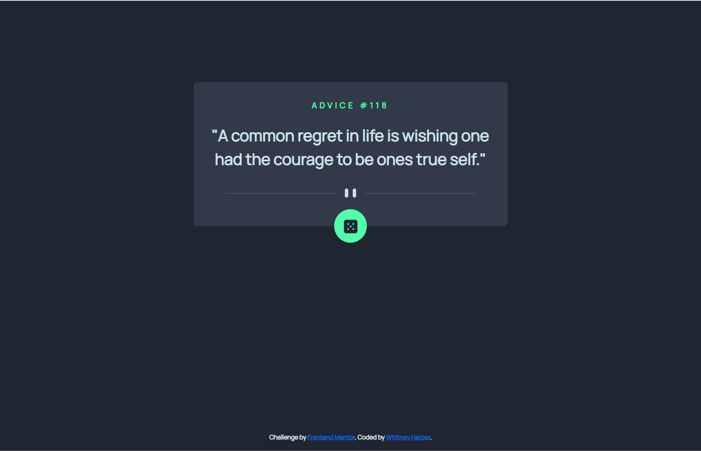

# Frontend Mentor - Intro component with sign up form solution

This is a solution to the [Intro component with sign up form challenge on Frontend Mentor](https://www.frontendmentor.io/challenges/advice-generator-app-QdUG-13db). Frontend Mentor challenges help you improve your coding skills by building realistic projects. 

## Table of contents

- [Overview](#overview)
  - [The challenge](#the-challenge)
  - [Screenshot](#screenshot)
  - [Links](#links)
- [My process](#my-process)
  - [Built with](#built-with)
- [Author](#author)

## Overview

### The challenge

Your challenge is to build out this advice generator app using the [Advice Slip API](https://api.adviceslip.com) and get it looking as close to the design as possible.

You can use any tools you like to help you complete the challenge. So if you've got something you'd like to practice, feel free to give it a go.

Your users should be able to:

- View the optimal layout for the app depending on their device's screen size
- See hover states for all interactive elements on the page
- Generate a new piece of advice by clicking the dice icon

### Screenshot

### Links

- Solution URL: [Frontend Mentor](https://www.frontendmentor.io/solutions/responsive-advice-generator-app-YqUeuCpZ0R)
- Live Site URL: [Advice generator app](https://whitneyharper.github.io/Advice_Generator_App/)

## My process

### Built with

- HTML
- CSS 
- JavaScript
- Bootstrap
- Mobile-first workflow

## Author

- Website - [Portfolio](https://whitneyharper.github.io/portfolio/)
- Frontend Mentor - [@whitneyharper](https://www.frontendmentor.io/profile/whitneyharper)
